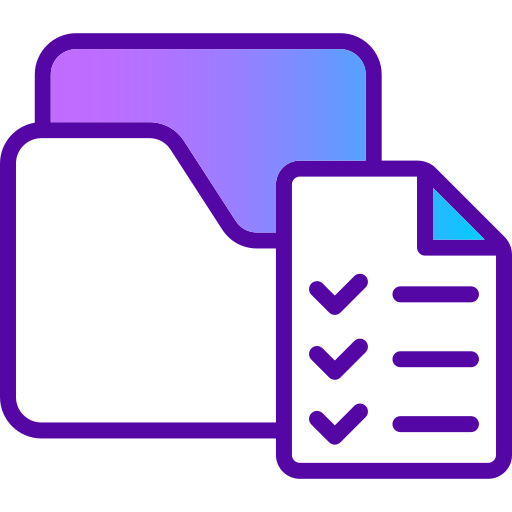

# 🚀 Flutter Practicals Portfolio

A comprehensive collection of 10 practical Flutter applications designed to demonstrate various Flutter concepts, from basic navigation to advanced features like API integration and state management.


## 📱 Screenshots

<div align="center">
  
</div>

## ✨ Features

### 🎯 **10 Practical Applications**

1. **Multi-Screen Navigation** - Complete navigation flow with splash, login, dashboard, and profile screens
2. **Temperature Converter** - Real-time temperature conversion between Celsius and Fahrenheit
3. **Dynamic To-Do App** - Full CRUD operations with state management using setState
4. **Form-based Registration** - Robust form validation with TextFormField and GlobalKey
5. **Student Records App** - Complete CRUD operations with in-memory data storage
6. **Notes App** - Persistent storage using SharedPreferences
7. **Product Catalog** - E-commerce inspired grid layout with network images
8. **REST API Data Display** - FutureBuilder implementation with error handling
9. **API-based Login Authentication** - Session management with SharedPreferences
10. **App Deployment & Versioning** - Comprehensive deployment guide

### 🎨 **UI/UX Features**

- **Modern Material Design 3** - Clean, contemporary interface
- **Smooth Animations** - Custom page transitions and loading animations
- **Adaptive UI** - Responsive design for phones, tablets, and desktops
- **Custom Loading States** - 4 different loading animation styles
- **Error Handling** - Beautiful error states with retry functionality
- **Professional Branding** - Custom logo and consistent theming

### 🔧 **Technical Features**

- **State Management** - setState implementation for dynamic UI updates
- **Navigation** - Flutter Navigator with custom transitions
- **API Integration** - HTTP requests with FutureBuilder
- **Data Persistence** - SharedPreferences for local storage
- **Form Validation** - Comprehensive input validation
- **Responsive Design** - LayoutBuilder for adaptive layouts
- **Error Handling** - Graceful error states and retry mechanisms

## 🛠️ Technical Stack

- **Framework**: Flutter 3.8.0+
- **Language**: Dart
- **State Management**: setState
- **Navigation**: Flutter Navigator
- **Storage**: SharedPreferences
- **HTTP**: http package
- **UI**: Material Design 3
- **Fonts**: Google Fonts (Inter)
- **Animations**: Flutter Animations package

## 📋 Prerequisites

Before running this project, make sure you have:

- Flutter SDK (3.8.0 or higher)
- Dart SDK
- Android Studio / VS Code
- Android SDK (for Android development)
- Xcode (for iOS development)

## 🚀 Getting Started

### 1. Clone the Repository

```bash
git clone https://github.com/yourusername/flutter-practicals.git
cd flutter-practicals
```

### 2. Install Dependencies

```bash
flutter pub get
```

### 3. Run the App

```bash
# For Android
flutter run

# For iOS
flutter run -d ios

# For Web
flutter run -d web

# For Desktop
flutter run -d windows
flutter run -d macos
flutter run -d linux
```

## 📱 Platform Support

| Platform | Status | Notes |
|----------|--------|-------|
| Android | ✅ | Fully supported |
| iOS | ✅ | Fully supported |
| Web | ✅ | Responsive design |
| Windows | ✅ | Desktop optimized |
| macOS | ✅ | Desktop optimized |
| Linux | ✅ | Desktop optimized |

## 🏗️ Project Structure

```
lib/
├── main.dart                          # Main app entry point
├── widgets/
│   ├── app_logo.dart                  # Custom logo widget
│   └── loading_widget.dart            # Loading animations
├── pages/
│   └── info_page.dart                 # App information page
├── practical1_navigation.dart         # Multi-screen navigation
├── practical2_temperature.dart        # Temperature converter
├── practical3_todo.dart              # To-Do app with setState
├── practical4_registration.dart      # Form validation
├── practical5_student_records.dart   # CRUD operations
├── practical6_notes.dart             # Persistent storage
├── practical7_product_catalog.dart   # GridView with images
├── practical8_api_data.dart          # API integration
├── practical9_login_auth.dart        # Authentication
└── practical10_deployment.dart       # Deployment guide
```

## 🎯 Practical Details

### Practical 1: Multi-Screen Navigation
- **Concepts**: Navigator, MaterialPageRoute, Data passing
- **Features**: Splash screen, Login form, Dashboard, Profile page
- **Duration**: 3-second splash screen with automatic navigation

### Practical 2: Temperature Converter
- **Concepts**: StatefulWidget, TextEditingController, Input validation
- **Features**: Real-time conversion, Clear functionality, Input validation
- **Formula**: °F = (°C × 9/5) + 32

### Practical 3: Dynamic To-Do App
- **Concepts**: setState, ListView.builder, Dynamic list management
- **Features**: Add, Edit, Delete, Mark complete, In-memory storage
- **UI**: Checkbox, ListTile, TextField

### Practical 4: Form-based Registration
- **Concepts**: Form, TextFormField, GlobalKey<FormState>, Validation
- **Features**: Email validation, Password confirmation, Real-time validation
- **Validation**: Email regex, Password length, Confirmation matching

### Practical 5: Student Records App
- **Concepts**: CRUD operations, AlertDialog, Data modeling
- **Features**: Add students, Edit records, Delete entries, List display
- **UI**: ListView.builder, AlertDialog, CircleAvatar

### Practical 6: Notes App
- **Concepts**: SharedPreferences, Persistent storage, Async operations
- **Features**: Save notes, Load on startup, Delete notes, Persistent data
- **Storage**: String list in SharedPreferences

### Practical 7: Product Catalog
- **Concepts**: GridView.builder, Network images, Card design
- **Features**: Responsive grid, Product cards, Image loading, Error handling
- **Images**: Unsplash product photos with loading states

### Practical 8: REST API Data Display
- **Concepts**: FutureBuilder, HTTP requests, JSON parsing, Error handling
- **Features**: API data fetching, Loading states, Error retry, Card layout
- **API**: JSONPlaceholder posts endpoint

### Practical 9: API-based Login Authentication
- **Concepts**: Session management, SharedPreferences, Navigation control
- **Features**: Login form, Session persistence, Dashboard, Logout
- **Security**: Simulated API authentication

### Practical 10: App Deployment & Versioning
- **Concepts**: APK generation, Keystore creation, Version management
- **Content**: Deployment guide, Versioning concepts, Store publishing
- **Platform**: Android deployment focus

## 🎨 Customization

### Theming
The app uses Material Design 3 with custom theming:
- **Primary Color**: Deep Purple
- **Secondary Color**: Teal
- **Typography**: Google Fonts (Inter)
- **Animations**: Custom page transitions

### Adding New Practicals
1. Create a new file: `lib/practicalX_name.dart`
2. Implement your practical as a StatefulWidget/StatelessWidget
3. Add to the `practicals` list in `main.dart`
4. Include proper documentation and comments

## 📊 Performance

- **Build Size**: Optimized for production
- **Memory Usage**: Efficient state management
- **Loading Times**: Fast app startup with splash screen
- **Animations**: Smooth 60fps animations
- **Responsive**: Adaptive UI for all screen sizes

## 🐛 Troubleshooting

### Common Issues

1. **Dependencies not found**
   ```bash
   flutter clean
   flutter pub get
   ```

2. **Build errors**
   ```bash
   flutter doctor
   flutter clean
   flutter pub get
   flutter run
   ```

3. **Image loading issues**
   - Check internet connection
   - Verify image URLs are accessible
   - Check error handling implementation

## 🤝 Contributing

1. Fork the repository
2. Create a feature branch (`git checkout -b feature/amazing-feature`)
3. Commit your changes (`git commit -m 'Add amazing feature'`)
4. Push to the branch (`git push origin feature/amazing-feature`)
5. Open a Pull Request

## 📄 License

This project is licensed under the MIT License - see the [LICENSE](LICENSE) file for details.

## 👨‍💻 Developer

**23AIML025 Harsh Kakadiya**

This portfolio showcases practical implementations of Flutter development concepts learned through hands-on experience.

## 🙏 Acknowledgments

- Flutter team for the amazing framework
- Material Design team for the design system
- Google Fonts for typography
- Unsplash for product images
- JSONPlaceholder for API testing

## 📞 Contact

For questions or suggestions, please open an issue or contact:

- **Email**: [your-email@example.com]
- **GitHub**: [@yourusername]
- **LinkedIn**: [Your LinkedIn Profile]

---

<div align="center">
  <p>Made with ❤️ using Flutter</p>
  <p>⭐ Star this repository if you found it helpful!</p>
</div>